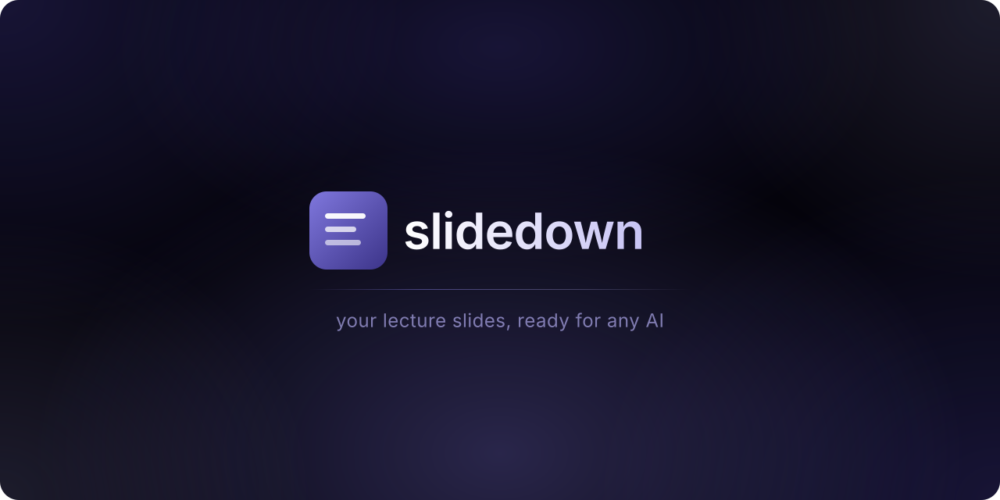
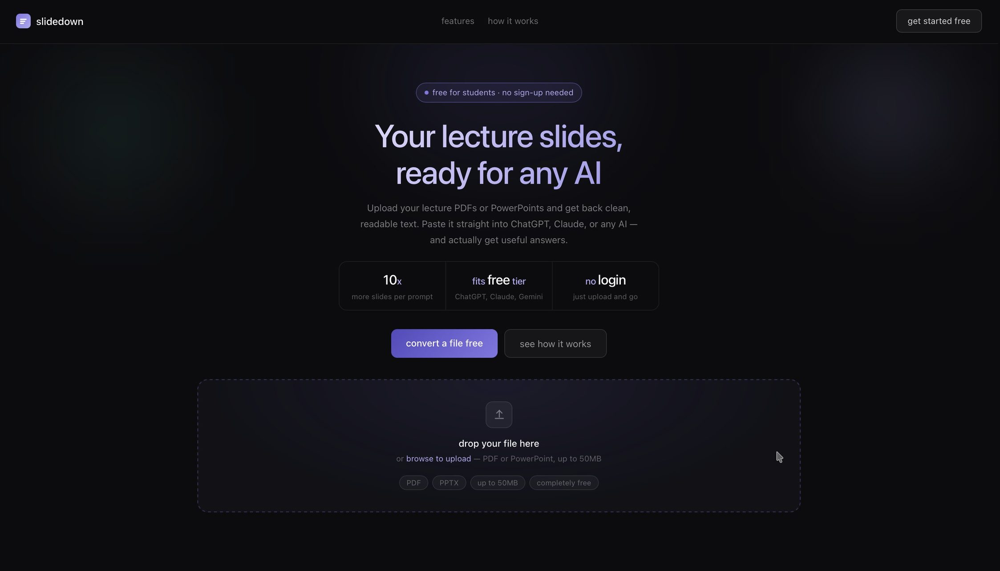
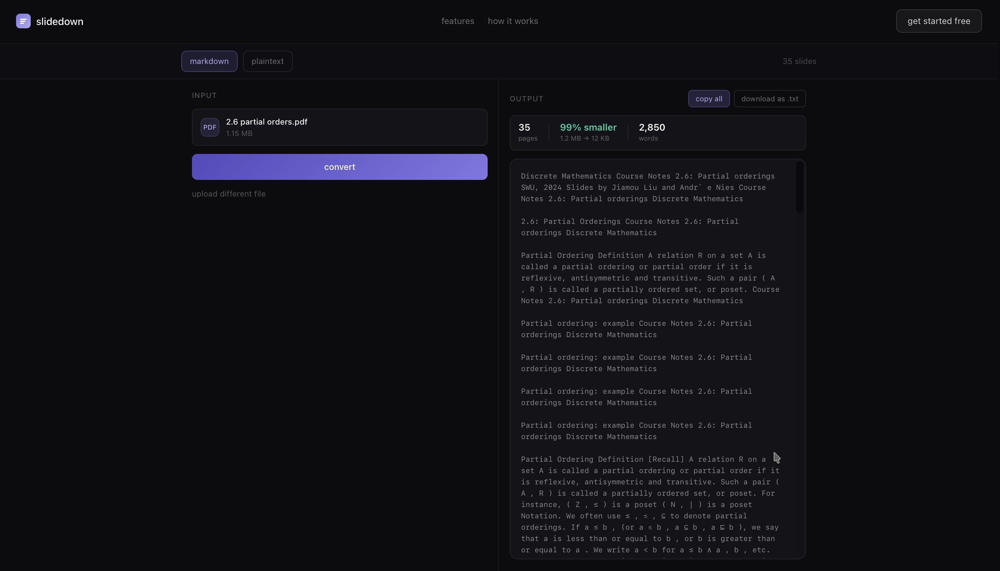

<p align="center">
  
</p>

<p align="center">
  <a href="https://vercel.com"></a>
  
  
  
</p>

<br>

Upload a lecture PDF or PowerPoint and get back clean, readable text you can paste straight into ChatGPT, Claude, Gemini, or any AI tool. No sign-up, no limits, no files leaving your browser.

## Screenshots

<p align="center">
  
  
</p>

## Features

- 📄 Supports PDF and PowerPoint (.pptx)
- ⚡ Client-side parsing — your files never leave your browser
- 📋 One-click copy for ChatGPT, Claude, Gemini, or any AI
- 📥 Download output as a `.txt` file
- 📊 Live stats: page count, size reduction, word count
- 🚫 No login, no sign-up, completely free

## Tech stack

| | |
|---|---|
| Framework | Next.js 16 (App Router) |
| Language | TypeScript |
| Styling | Tailwind CSS v4 + shadcn/ui |
| PDF parsing | pdfjs-dist (client-side) |
| PPTX parsing | jszip (client-side) |
| Hosting | Vercel |

## Getting started

```bash
git clone https://github.com/andrecamerino/slidedown.git
cd slidedown
pnpm install
pnpm dev
```

Open [http://localhost:3000](http://localhost:3000)

## Roadmap

| Phase | Status | Features |
|-------|--------|----------|
| 1 — MVP | ✅ Done | PDF/PPTX convert, copy output, landing page |
| 2 — Auth | Planned | Clerk login, Supabase library, usage limits |
| 3 — AI | Planned | Flashcards, summary templates, Stripe |
| 4 — Canvas | Planned | OAuth integration, institutional pitch |

## License

MIT
